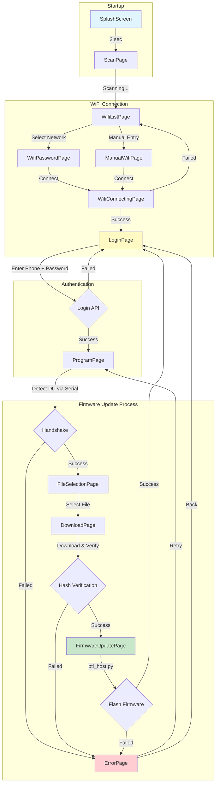
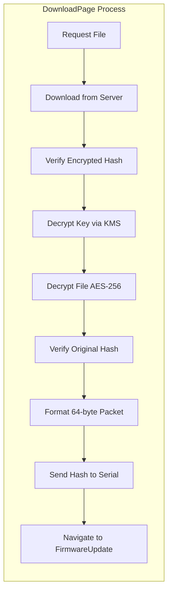
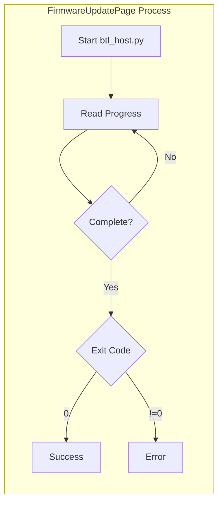
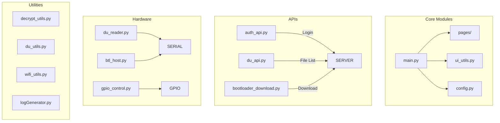

# CZAR Bootloader - Application Flow

## Page Navigation Flowchart

## Detailed Process Flow

## Page Descriptions

| Page | Purpose |
|------|---------|
| **SplashScreen** | Shows logo on startup |
| **ScanPage** | Scans for WiFi networks |
| **WifiListPage** | Displays available networks |
| **WifiPasswordPage** | Enter password for selected network |
| **ManualWifiPage** | Manually enter SSID and password |
| **WifiConnectingPage** | Shows connection progress |
| **LoginPage** | Service engineer authentication |
| **ProgramPage** | Detects DU and performs handshake |
| **FileSelectionPage** | Select firmware file from server |
| **DownloadPage** | Downloads, verifies, and prepares firmware |
| **FirmwareUpdatePage** | Flashes firmware via btl_host.py |
| **ErrorPage** | Displays errors with retry option |

## Key Components

