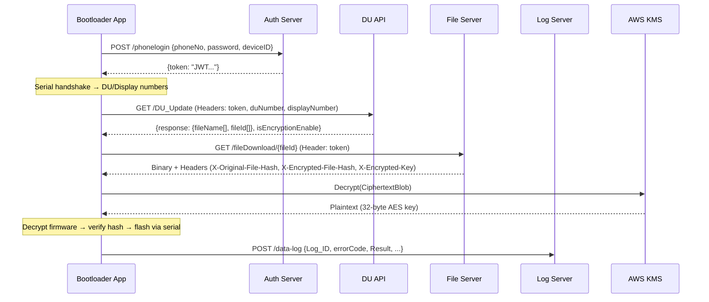

# API Data Formats Reference

All JSON formats sent to and received from the server by the CZAR Python Bootloader app.

---

## 1. Login — `POST /api/auth/serviceEngineer/phonelogin`

**Source:** [auth_api.py](file:///home/dishant/DISHANTFOLDER/CZAR/BOOTLOADER/python_bootloader/api/auth_api.py)  
**Base URL:** `https://bootloader.czarmetricsystem.com`

### Request

```json
{
  "phoneNo": "+919876543210",
  "password": "password123",
  "deviceID": "41999990"
}
```

| Field | Type | Description |
|---|---|---|
| `phoneNo` | string | Phone number with country code (e.g. `+91XXXXXXXXXX`) |
| `password` | string | User password |
| `deviceID` | string | Hardcoded device ID (`"41999990"`) |

### Response — Success (HTTP 200)

```json
{
  "token": "eyJhbGciOiJIUzI1NiIsInR5cCI6IkpXVCJ9..."
}
```

| Field | Type | Description |
|---|---|---|
| `token` | string | JWT authentication token for subsequent API calls |

### Response — Failure (HTTP 4xx/5xx)

```json
{
  "message": "Invalid credentials"
}
```

---

## 2. Fetch DU List — `GET /api/dispenserUnit/DU_Update`

**Source:** [du_api.py](file:///home/dishant/DISHANTFOLDER/CZAR/BOOTLOADER/python_bootloader/api/du_api.py)  
**Base URL:** `SERVER_URL` env var or `https://bootloader.czarmetricsystem.com`

### Request

No JSON body — data is sent via **custom headers**:

```
Authorization: Bearer <JWT_TOKEN>
deviceID: 41999990
duNumber: 12345678
displayNumber: 87654321
```

| Header | Type | Description |
|---|---|---|
| `Authorization` | string | `Bearer` + JWT token from login |
| `deviceID` | string | Device ID from environment or `"41999990"` |
| `duNumber` | string | DU serial number read from hardware handshake |
| `displayNumber` | string | Display serial number read from hardware handshake |

### Response — Success (HTTP 200)

```json
{
  "response": {
    "fileName": ["firmware_v2.1.bin", "firmware_v2.0.bin"],
    "fileId": ["64a1b2c3d4e5f6a7b8c9d0e1", "64a1b2c3d4e5f6a7b8c9d0e2"],
    "duNumber": 12345678,
    "displayNumber": 87654321
  },
  "isEncryptionEnable": true
}
```

| Field | Type | Description |
|---|---|---|
| `response` | object | Contains firmware options |
| `response.fileName` | string[] | List of available firmware file names |
| `response.fileId` | string[] | Corresponding file IDs (MongoDB ObjectIds) |
| `response.duNumber` | number | Echo of DU serial number |
| `response.displayNumber` | number | Echo of Display serial number |
| `isEncryptionEnable` | boolean | Whether firmware encryption is enabled for this DU |

### Response — Failure (HTTP 4xx/5xx)

```json
{
  "message": "Error description"
}
```

---

## 3. File Download — `GET /api/file/fileDownload/{fileId}`

**Source:** [bootloader_download.py](file:///home/dishant/DISHANTFOLDER/CZAR/BOOTLOADER/python_bootloader/core/bootloader_download.py)  
**Base URL:** `SERVER_URL` env var

### Request

```
GET /api/file/fileDownload/64a1b2c3d4e5f6a7b8c9d0e1
Authorization: Bearer <JWT_TOKEN>
```

| Parameter | Location | Description |
|---|---|---|
| `fileId` | URL path | MongoDB ObjectId of the firmware file |
| `Authorization` | Header | `Bearer` + JWT token |

### Response — Success (HTTP 200)

**Body:** Raw binary firmware file (encrypted `.bin`)

**Custom Response Headers:**

| Header | Type | Description |
|---|---|---|
| `X-Original-File-Hash` | string | SHA-256 hex hash of the **decrypted** firmware |
| `X-Encrypted-File-Hash` | string | SHA-256 hex hash of the **encrypted** firmware (body) |
| `X-Encrypted-Key` | string | JSON string containing base64-encoded AWS KMS encrypted data key |

**`X-Encrypted-Key` format:**

```json
["BASE64_ENCODED_CIPHERTEXT_BLOB"]
```

This is a JSON array with a single base64 string. When decoded and decrypted via AWS KMS, it yields the 32-byte AES-256 key used to decrypt the firmware file.

### Verification Flow

```
1. Download body → SHA-256 → compare with X-Encrypted-File-Hash  ✓
2. Parse X-Encrypted-Key → base64 decode → KMS decrypt → AES key
3. AES-256-ECB decrypt body with key → decrypted firmware
4. SHA-256 of decrypted → compare with X-Original-File-Hash  ✓
```

---

## 4. Audit Log — `POST {SERVER_URL}api/logs/data-log`

**Source:** [logGenerator.py](file:///home/dishant/DISHANTFOLDER/CZAR/BOOTLOADER/python_bootloader/core/logGenerator.py)  
**Base URL:** `SERVER_URL` env var (constructed in `config.py`)

### Request

```json
{
  "Log_ID": "41999990_260219150530_1",
  "phoneNo": "+91-9876543210",
  "IP_Address": "192.168.1.100",
  "Date": "26-02-2026",
  "Time": "15:05:30",
  "DISPENSER_Serial_Number": "12345678",
  "DISPLAY_Serial_Number": "87654321",
  "FileName": "firmware_v2.1.bin",
  "Result": "Fail",
  "Error_Description": "Downloaded file hash does not match",
  "errorCode": "E-23"
}
```

| Field | Type | Description |
|---|---|---|
| `Log_ID` | string | Unique ID: `{deviceID}_{YYMMDDHHMMSS}_{serialNo}` |
| `phoneNo` | string | Logged-in user's phone number |
| `IP_Address` | string | Device's local IP (via UDP socket to `8.8.8.8`) |
| `Date` | string | Format: `DD-MM-YYYY` |
| `Time` | string | Format: `HH:MM:SS` |
| `DISPENSER_Serial_Number` | string | DU number from serial handshake |
| `DISPLAY_Serial_Number` | string | Display number from serial handshake |
| `FileName` | string | Firmware file name or file ID being processed |
| `Result` | string | `"Fail"` or `"Success"` |
| `Error_Description` | string | Human-readable error description |
| `errorCode` | string | Error code (see table below) |

### Error Codes

| Code | Name | Trigger |
|---|---|---|
| `E-15` | DU Detect Failed | Handshake SOP/EOP validation failure |
| `E-16` | DU Detect Error | CRC validation failure |
| `E-17` | DU Number Invalid | DU number = 0 or out of range |
| `E-18` | Display Number Invalid | Display number = 0 or out of range |
| `E-21` | File Download Failed | HTTP non-200 response from file server |
| `E-23` | Encrypted File Hash Mismatch | Downloaded file SHA-256 ≠ server header |
| `E-24` | Original File Hash Mismatch | Decrypted file SHA-256 ≠ server header |
| `E-51` | Login Failed | Invalid credentials |

### Response

No specific response structure is consumed by the app. Status code is logged.

---

## 5. Internet Connectivity Check — `GET https://www.google.com`

**Source:** [system_utils.py](file:///home/dishant/DISHANTFOLDER/CZAR/BOOTLOADER/python_bootloader/utils/system_utils.py)

Simple reachability check. No JSON involved — just checks for HTTP 200 within timeout.

---

## Summary: Data Flow Diagram


