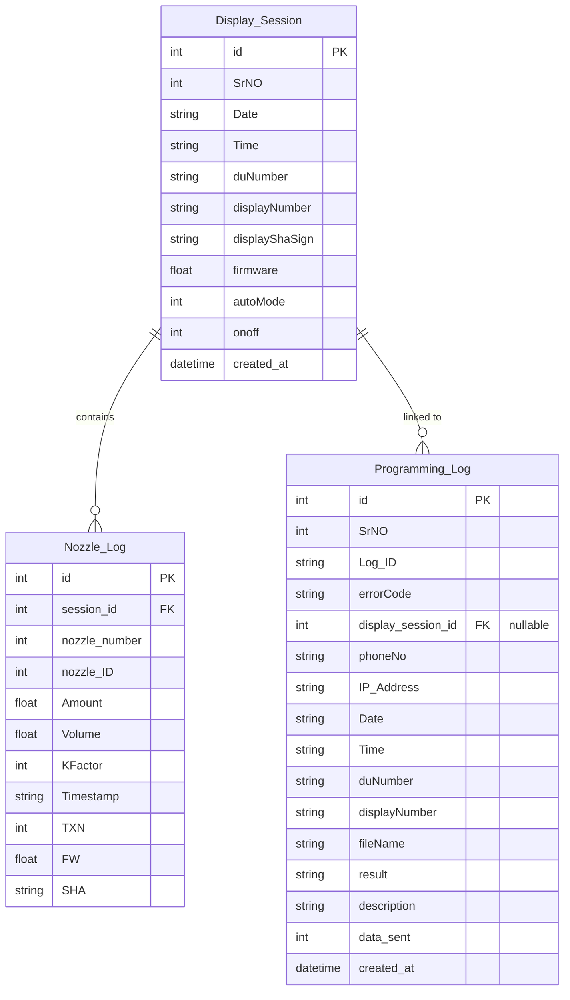

# CZAR Bootloader - Database Access Guide

This guide explains how the application database is structured, where it is located, and how to view, query, and access its contents.

---

## 1. Database Overview

The application utilizes an **SQLite3** database for local, persistent record-keeping. The database schema and entities are managed using the **Peewee ORM**.

*   **Database File Path:** `~/.czar-bootloader/bootloader.db` (Resolves to `/home/<user>/.czar-bootloader/bootloader.db` on Linux)
*   **Backup/Parallel Logs:** The application also writes raw logs to CSV files in the same directory:
    *   `~/.czar-bootloader/logs.csv` (corresponds to programming attempt logs)
    *   `~/.czar-bootloader/Display_log.csv` (corresponds to display handshake data logs)

> [!NOTE]
> The database directory is located outside the project directory. This design ensures that application updates, virtual environment recreations, or rebuilds do not destroy or overwrite existing logs and historical data.

---

## 2. Table Schemas & Relationships

The database contains three main tables defined in `core/models.py`:



### 2.1 Table: `Display_Session`
Stores one record for each successful 512-byte handshake between the bootloader application and a dispenser display.

| Column | Type | Description |
| :--- | :--- | :--- |
| `id` | `INTEGER` (PK) | Auto-incrementing primary key. |
| `SrNO` | `INTEGER` | Serial number identifier synced from display log. |
| `Date` | `TEXT` | Handshake date (`DD/MM/YYYY` format). |
| `Time` | `TEXT` | Handshake time (`HH:MM:SS` format). |
| `duNumber` | `TEXT` | 8-digit DU (Dispenser Unit) serial number. |
| `displayNumber` | `TEXT` | 8-digit Display serial number. |
| `displayShaSign` | `TEXT` | SHA-256 signature of the display firmware (`0x...`). |
| `firmware` | `REAL` | Firmware version (e.g. `11.13`). |
| `autoMode` | `INTEGER` | Operation mode (`0` = Manual, `1` = Auto). |
| `onoff` | `INTEGER` | On/Off state (`0` = Off, `1` = On). |
| `created_at` | `TEXT` | Local timestamp when row was written. |

### 2.2 Table: `Nozzle_Log`
Stores sub-records for individual nozzles (4 nozzles are logged per display handshake session).

| Column | Type | Description |
| :--- | :--- | :--- |
| `id` | `INTEGER` (PK) | Auto-incrementing primary key. |
| `session_id` | `INTEGER` (FK) | Links to parent `Display_Session(id)`. Deletes on cascade. |
| `nozzle_number` | `INTEGER` | Nozzle position (`1`, `2`, `3`, or `4`). |
| `nozzle_ID` | `INTEGER` | Nozzle hardware type identifier. |
| `Amount` | `REAL` | Total dispensed amount currency transaction. |
| `Volume` | `REAL` | Total dispensed volume. |
| `KFactor` | `INTEGER` | Nozzle calibration factor. |
| `Timestamp` | `TEXT` | Date/time of nozzle's last transaction (`date/month/year-hr:min:sec`). |
| `TXN` | `INTEGER` | Total transaction count. |
| `FW` | `REAL` | Nozzle firmware version. |
| `SHA` | `TEXT` | SHA-256 signature of the nozzle firmware (`0x...`). |

### 2.3 Table: `Programming_Log`
Stores audit trails of every firmware update attempt (both successful updates and failures).

| Column | Type | Description |
| :--- | :--- | :--- |
| `id` | `INTEGER` (PK) | Auto-incrementing primary key. |
| `SrNO` | `INTEGER` | Log serial number. |
| `Log_ID` | `TEXT` | Unique ID formatted as `deviceID_YYMMDDHHMMSS_serialNumber`. |
| `errorCode` | `TEXT` | Error code (e.g., `S-01` for success, `E-31`, `E-51` for failures). |
| `display_session_id` | `INTEGER` (FK) | Reference to `Display_Session(id)`. Set to `NULL` if handshake failed. |
| `phoneNo` | `TEXT` | Phone number of the active service engineer. |
| `IP_Address` | `TEXT` | Local IP address of the programming controller. |
| `Date` | `TEXT` | Attempt date (`DD-MM-YYYY` format). |
| `Time` | `TEXT` | Attempt time (`HH:MM:SS` format). |
| `duNumber` | `TEXT` | DU serial number (if handshake succeeded). |
| `displayNumber` | `TEXT` | Display serial number (if handshake succeeded). |
| `fileName` | `TEXT` | Target firmware filename (if selected). |
| `result` | `TEXT` | Operation outcome (`Success`, `Fail`, or `Failed`). |
| `description` | `TEXT` | Verbose description of the outcome or error reason. |
| `data_sent` | `INTEGER` | Sync status flag (`0` = pending upload to server, `1` = synced). |
| `created_at` | `TEXT` | Local timestamp of the programming attempt. |

---

## 3. How to View and Query the Database

### Method 1: Using a GUI Client (DB Browser for SQLite)

This is the recommended visual way to search, filter, and inspect data.

1.  **Install DB Browser for SQLite:**
    ```bash
    sudo apt update
    sudo apt install sqlitebrowser -y
    ```
2.  **Open the database:**
    Launch the application and open the database file located at `~/.czar-bootloader/bootloader.db`. Alternatively, run from terminal:
    ```bash
    sqlitebrowser ~/.czar-bootloader/bootloader.db
    ```
3.  Use the **"Browse Data"** tab to view tables, or use the **"Execute SQL"** tab to run custom database queries.

---

### Method 2: Command Line CLI (`sqlite3`)

You can directly interact with the database using the built-in SQLite CLI tool.

1.  **Open the CLI:**
    ```bash
    sqlite3 ~/.czar-bootloader/bootloader.db
    ```
2.  **Useful SQLite commands:**
    ```sql
    .tables                 -- Lists all tables
    .schema Programming_Log -- Shows database schema for the programming logs
    .headers on             -- Shows column names in query results
    .mode column            -- Formats output into structured columns
    .exit                   -- Exits the CLI shell
    ```

3.  **Example SQL queries:**

    *   **Fetch last 10 programming attempts:**
        ```sql
        SELECT SrNO, Log_ID, errorCode, result, duNumber, displayNumber, fileName, description 
        FROM Programming_Log 
        ORDER BY id DESC 
        LIMIT 10;
        ```

    *   **Count successes vs failures:**
        ```sql
        SELECT result, COUNT(*) 
        FROM Programming_Log 
        GROUP BY result;
        ```

    *   **Find all nozzles logged for a display session:**
        ```sql
        SELECT nozzle_number, nozzle_ID, Amount, Volume, KFactor, FW 
        FROM Nozzle_Log 
        WHERE session_id = 1; -- Replace with target display session ID
        ```

---

### Method 3: Python Interactive Shell (Peewee ORM)

Since Peewee models represent the database tables, you can run Python code within the application's environment to read the database.

1.  **Navigate to the project and activate the virtual environment:**
    ```bash
    cd /home/czar/app/python_bootloader
    source venv/bin/activate
    ```
2.  **Start the Python interactive terminal:**
    ```bash
    python
    ```
3.  **Execute Python/Peewee commands:**
    ```python
    from core.models import DisplaySession, ProgrammingLog, NozzleLog

    # Count database entries
    print("Sessions:", DisplaySession.select().count())
    print("Programming attempts:", ProgrammingLog.select().count())

    # Find programming logs with errors
    failed_attempts = ProgrammingLog.select().where(ProgrammingLog.result != 'Success')
    for attempt in failed_attempts.limit(5):
        print(f"ID: {attempt.Log_ID} | Error: {attempt.errorCode} | Desc: {attempt.description}")

    # Fetch a session and list its nozzles
    latest_session = DisplaySession.select().order_by(DisplaySession.id.desc()).first()
    if latest_session:
        print(f"Latest Handshake: DU {latest_session.duNumber} on {latest_session.Date}")
        for nozzle in latest_session.nozzles:
            print(f"  Nozzle #{nozzle.nozzle_number} (ID: {nozzle.nozzle_ID}) - FW: {nozzle.FW}")
    ```

---

## 4. Troubleshooting and Permissions

> [!WARNING]
> Do not attempt to modify the database file manually using sqlite3 unless the application is completely closed. Multiple concurrent writers can lock the SQLite database (`database is locked` error).

*   **Path verification:**
    If you are unsure where the database resolved to, run:
    ```bash
    python3 -c "import os; print(os.path.expanduser('~/.czar-bootloader/bootloader.db'))"
    ```
*   **Database locks / Permission Issues:**
    Ensure the user running the application has read/write permissions for both the directory `~/.czar-bootloader/` and the files within it. Verify permissions with:
    ```bash
    ls -la ~/.czar-bootloader
    ```
    If permissions are owned by another user (e.g. `root`), change them back using:
    ```bash
    sudo chown -R $USER:$USER ~/.czar-bootloader
    ```
